# Oh, the Places You'll Drive in L.A.!

*A poem in the style of Dr. Seuss*

In the land of the sun where the palm trees grow tall,
There's a city so big that it's not small at all!
It sprawls and it stretches, it zigs and it zags,
From the beaches to hills to the Hollywood flags.

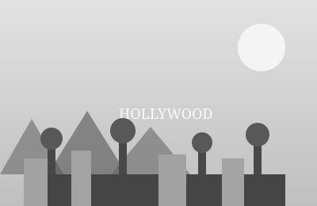

Oh, the cars! Oh, the cars! How they honk, how they crawl,
On the 405, 101, 10 — and that's not even all!
"I'll be there in ten!" said a man in a Prius.
Three hours later? He still hadn't seen us.

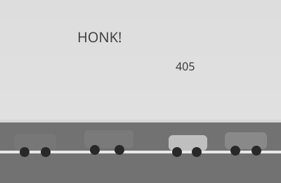

There are stars on the sidewalk, all shiny and pink,
With names you might know (or might not, I think).
There's a sign on a hill that says HOLLYWOOD loud,
And it waves at the smog and it winks at the cloud.

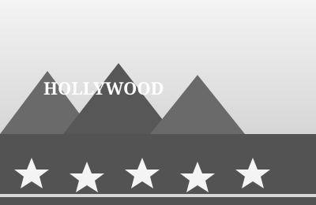

Down in Venice the skaters go swish and go swoosh,
Past a man with a snake and a lady named Roosh.
There are muscles at Muscle Beach, lifting with grunts,
And a juggler on stilts doing seven odd stunts!

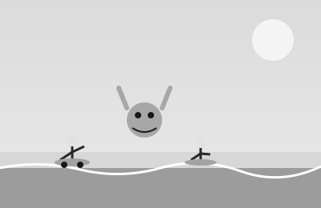

In Santa Monica, look! There's a pier with a wheel,
That goes round and around with a creak and a squeal.
You can ride it up high, you can see the whole bay,
Where the sea lions bark and the dolphins at play.

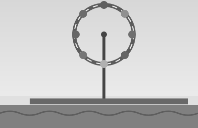

Would you eat a taco? A taco from a truck?
Would you eat it at midnight? You would, with some luck!
With carnitas, al pastor, and salsa so hot,
You will eat one, and two, and then eat the whole lot!

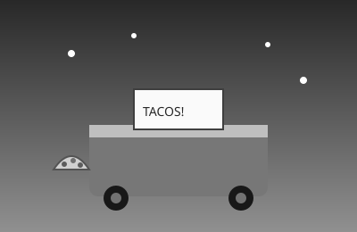

Would you eat it in Echo Park? Eat it in Silver Lake?
Would you eat it with kale and a green juicy shake?
"I will eat it! I'll eat it! I'll eat it all day!
I do so love tacos! I do love L.A.!"

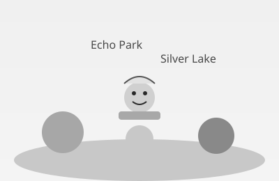

There's a Griffith-y place where the stars come out bright,
With a telescope pointing up into the night.
There are coyotes that yip in the hills after dark,
And a dodger-blue crowd cheering loud at the park!

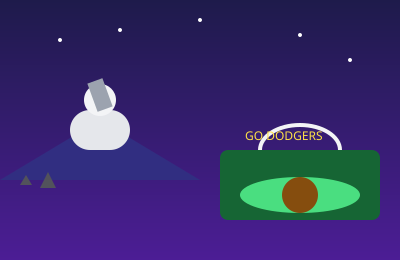

It's not cold. It's not wet. It's just sunny and fine,
Every day, every week (well, it rains once a time).
And the people say "dude" and the people say "rad,"
And the sunsets are purple and orange and glad.

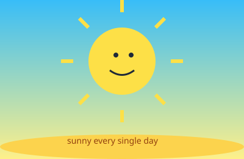

Down in the Downtown the tall towers rise,
Reflecting the sunset in gold-colored skies.
A little old train car named Angels in Flight
Climbs up Bunker Hill with a creak, left and right.

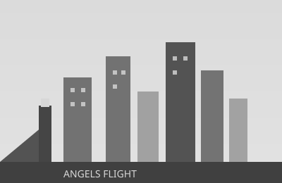

At night in a museum, where art likes to play,
A hundred bright lampposts all glow till it's day.
They stand in neat rows like a tall metal choir —
That's Urban Light, dear, all aglow and afire!

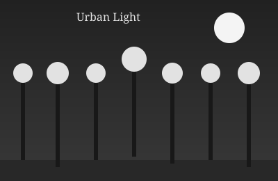

Would you like a burger? One Double-Double, please?
Animal style, with the sauce and the cheese?
In a red and white building, with palm trees in view,
In-N-Out serves them — would you like one or two?

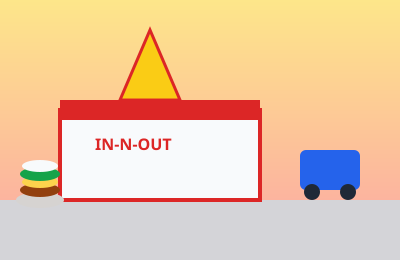

Way out in Malibu the waves curl up tall,
And a surfer named Sam catches each and all.
He paddles, he pops up, he rides to the shore,
Then paddles right back out to catch one wave more!

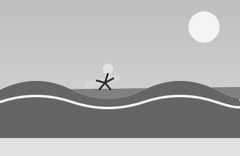

Under the stars at the Hollywood Bowl,
The music plays sweet and the violins roll.
With a picnic basket and blanket spread wide,
You hum along softly beneath the hillside.

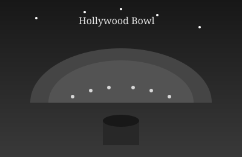

Up on a hill where white buildings gleam white,
The Getty looks down on the city at night.
With gardens and fountains and art old and new,
You can see clear to the ocean's blue-grey view.

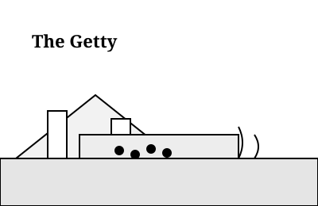

Downtown there's a market, Grand Central by name,
With fruit stands and fish stalls, each one just the same —
Well, not quite the same, there are donuts and more,
And pupusas and coffee behind every door!

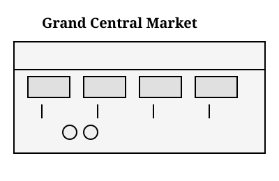

On Olvera Street, where the papel picado flies,
The vendors sell trinkets of every size.
There's mariachi music and churros so sweet,
On the oldest, the brickiest, liveliest street!

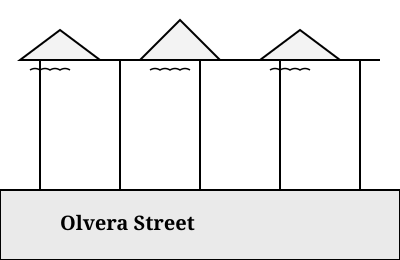

In Watts there are towers all covered in tile,
Made of bottles and seashells, stacked mile after mile.
One man built them alone, with his hands and his heart,
A spiky, spindly, spectacular work of art!

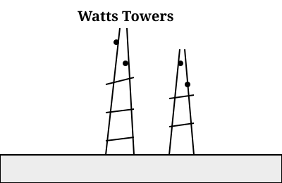

Out by the airport the jets roar and soar,
Past a building with legs that reach up to explore.
It's shaped like a spaceship, all arches and gleam —
The Theme Building watches each plane like a dream.

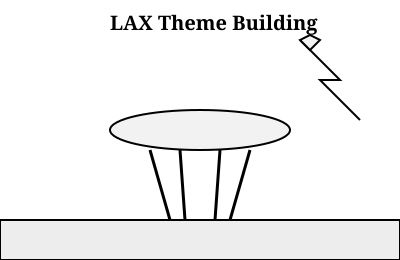

So pack up your sunglasses, flip-flops, and hat,
And your patience for traffic (you'll need lots of that).
Oh, the places you'll go! Oh, the things you will see!
In the City of Angels — L.A., by the sea!

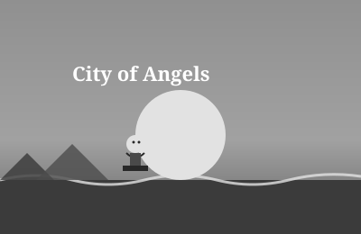
